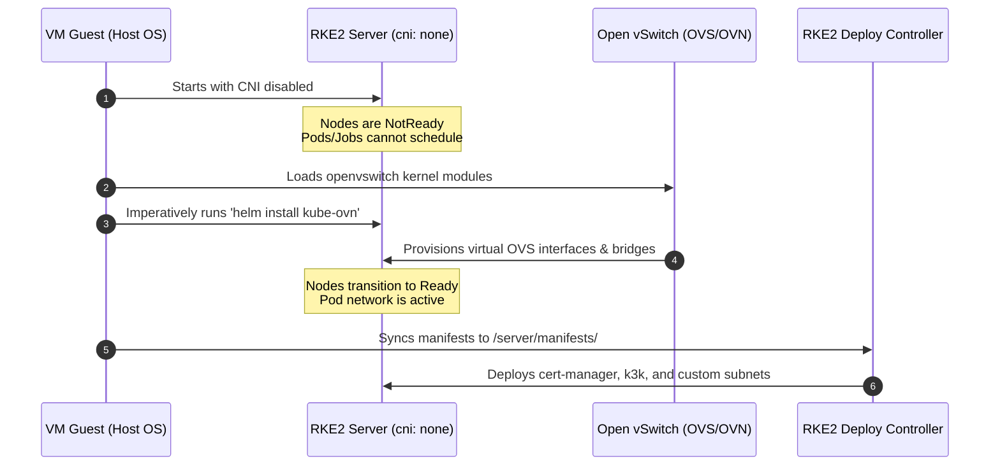

# Kube-OVN as CNI for k3k Virtual Clusters on RKE2

This repository sets up **Kube-OVN** as the primary Container Network Interface (CNI) for virtual Kubernetes clusters created by **k3k** in **shared mode**, running on top of an **RKE2 host cluster**.

---

## Architecture Overview

```
+---------------------------------------------------------------------------------+
| RKE2 Host Cluster (CNI: Kube-OVN)                                               |
|                                                                                 |
|  +---------------------------+  +--------------------------------------------+  |
|  | Host Namespace: default   |  | Host Namespace: k3k-kube-ovn-cluster       |  |
|  | (Host workloads)          |  | (Virtual Cluster Workloads)                |  |
|  |                           |  |                                            |  |
|  | [Pod] (IP: 10.42.x.x)     |  | [Virtual Pod] (IP: 10.16.x.x)              |  |
|  +---------------------------+  +--------------------------------------------+  |
|                                                                                 |
|  +---------------------------+  +--------------------------------------------+  |
|  | OVN Subnet: default-subnet|  | OVN Subnet: k3k-kube-ovn-subnet            |  |
|  | CIDR: 10.42.0.0/16        |  | CIDR: 10.16.0.0/16 (private: false)         |  |
|  +---------------------------+  +--------------------------------------------+  |
+---------------------------------------------------------------------------------+
```

### Key Architectural Concepts

1. **Host-Level CNI Control:** RKE2 is configured with `cni: none` [lima/k3k-kube-ovn.yaml:L57](lima/k3k-kube-ovn.yaml#L57). Kube-OVN is installed on the host RKE2 cluster to manage physical OVS bridges and all core networking.
2. **Namespace-to-Subnet Binding:** A custom Kube-OVN `Subnet` [manifests/kube-ovn/subnet.yaml](manifests/kube-ovn/subnet.yaml) is defined on the host with CIDR `10.16.0.0/16` and is annotated directly to bind with the virtual cluster's namespace (`k3k-kube-ovn-cluster`) [manifests/k3k/namespace.yaml](manifests/k3k/namespace.yaml). Workloads scheduled inside the virtual cluster are translated to the host and automatically assigned IPs from this isolated range.
3. **Kubelet API Communication:** The virtual cluster's `k3k-kubelet` agent must be able to talk to the host cluster's Kubernetes API server IP (`10.43.0.1:443`). To unblock this traffic, the subnet has `private: false` (strict isolation disabled) [manifests/kube-ovn/subnet.yaml:L12](manifests/kube-ovn/subnet.yaml#L12), preventing a container creation deadlock.
4. **Declarative & Single Source of Truth:** The Lima configuration mounts the host directory read-only [lima/k3k-kube-ovn.yaml:L21-L22](lima/k3k-kube-ovn.yaml#L21-L22). On boot, the provisioning scripts automatically copy manifests from the mounted path to `/var/lib/rancher/rke2/server/manifests/` [lima/k3k-kube-ovn.yaml:L158-L193](lima/k3k-kube-ovn.yaml#L158-L193) to be natively deployed by RKE2, removing any double-maintenance overhead.

### CNI Bootstrapping Flow & Deadlock Resolution

Deploying CNIs and platform components on an empty cluster requires resolving a fundamental chicken-and-egg scheduling deadlock:



1. **The Chicken-and-Egg Deadlock:** RKE2 starts with `cni: none` [lima/k3k-kube-ovn.yaml:L57](lima/k3k-kube-ovn.yaml#L57). Because there is no active CNI, nodes remain in `NotReady` status. Standard controllers (including RKE2's built-in manifest processor) schedule Helm chart deployments as standard Kubernetes jobs/pods. If Kube-OVN were defined declaratively in the manifests directory, its installation job would wait infinitely for a network to run—creating a circular dependency.
2. **The Resolution:** 
   - First, the host system loads the required host-level `openvswitch` kernel module [lima/k3k-kube-ovn.yaml:L95](lima/k3k-kube-ovn.yaml#L95).
   - Second, the provisioning script imperatively installs the Helm CLI and runs `helm install kube-ovn` [lima/k3k-kube-ovn.yaml:L124](lima/k3k-kube-ovn.yaml#L124) in the host network space.
   - Once Kube-OVN is running, the host nodes become `Ready` [lima/k3k-kube-ovn.yaml:L140](lima/k3k-kube-ovn.yaml#L140).
   - Finally, the project directory is located on the read-only host mount, and all declarative manifests (for cert-manager, k3k, and subnet annotations) are copied over to RKE2's manifest directory [lima/k3k-kube-ovn.yaml:L158-L193](lima/k3k-kube-ovn.yaml#L158-L193). They are then natively executed by RKE2's built-in deploy controller.

---

## Tech Stack

| Component | Version | Role |
| :--- | :--- | :--- |
| **Lima** | latest | macOS VM manager (openSUSE Leap guest) |
| **RKE2** | latest | Base host Kubernetes distribution |
| **k3k** | latest | Lightweight virtual Kubernetes clusters |
| **Kube-OVN** | `v1.16.2` | Advanced CNI and subnet mapping |

---

## Directory Structure

```
.
├── README.md                      # This file
├── GEMINI.md                      # Gemini AI context and instructions
├── lima/
│   └── k3k-kube-ovn.yaml         # Lima VM template with read-only mounts & auto-sync
└── manifests/
    ├── k3k/
    │   ├── k3k-helmchart.yaml    # Declarative HelmChart for k3k
    │   ├── namespace.yaml        # Namespace with Kube-OVN subnet annotations
    │   └── cluster.yaml          # k3k virtual cluster spec (shared mode)
    └── kube-ovn/
        └── subnet.yaml           # Host Kube-OVN subnet mapped to virtual namespace
```

---

## Network Layout

| Network | CIDR | Used By |
| :--- | :--- | :--- |
| **Host Pod** | `10.42.0.0/16` | RKE2 host default subnet (Kube-OVN) |
| **Host Service**| `10.43.0.0/16` | RKE2 host cluster services |
| **vCluster Pod**| `10.16.0.0/16` | Kube-OVN subnet mapped to virtual cluster namespace |
| **vCluster Svc**| `10.96.0.0/12` | k3k virtual cluster services |
| **Join Network**| `100.64.0.0/16` | Kube-OVN node-to-pod bridge |

---

## Quick Start (Lima on Mac)

### 1. Start the VM
The Lima template provisions the openSUSE Leap VM, mounts your host home directory, and automates copying all manifests:

```bash
# Create the VM instance
limactl create --name k3k-kube-ovn lima/k3k-kube-ovn.yaml

# Start the VM instance (mounts host paths)
limactl start k3k-kube-ovn
```

### 2. Verify Deployments
Shell into the VM and verify the status of components. Kubectl is pre-configured:

```bash
# Access the VM shell
limactl shell k3k-kube-ovn

# Check that the host node is Ready
kubectl get nodes

# Check that all pods are running successfully
kubectl get pods -A
```

Expected output:
* Kube-OVN, cert-manager, and k3k pods are in `Running` state in `kube-system`, `cert-manager`, and `k3k-system` namespaces.

---

## Verification & Troubleshooting

### 1. View OVN Subnets
To verify that the custom virtual subnet is active:
```bash
kubectl get subnet k3k-kube-ovn-subnet
```

### 2. Check Virtual Pod IPs
Verify that virtual pods and test pods schedule directly inside the custom host-level subnet CIDR (`10.16.0.0/16`):
```bash
kubectl get pods -n k3k-kube-ovn-cluster -o wide
```

Expected IP allocation:
* `k3k-kube-ovn-cluster-kubelet-...` $\rightarrow$ `10.16.0.x`
* `k3k-kube-ovn-cluster-server-0` $\rightarrow$ `10.16.0.x`

### 3. Empirical Subnet Connectivity Validation (The Test Pod)

To verify network traffic routing, deploy the alpine test pod [manifests/test-pod.yaml](manifests/test-pod.yaml) inside the guest cluster namespace on the host. This pod runs directly on the virtual subnet to ensure all routing paths are fully functional.

#### Deploy the Test Pod
```bash
kubectl apply -f manifests/test-pod.yaml -n k3k-kube-ovn-cluster
```

#### Confirm IP Assignment
Check that the test pod has been successfully assigned an IP in the `10.16.0.0/16` range:
```bash
kubectl get pod test-pod -n k3k-kube-ovn-cluster -o wide
```

#### Run Connectivity Ping Tests
1. **Host Kubernetes API Server Gateway (`10.43.0.1`):**
   Verify that the pod can communicate with the host API server (unblocked by `private: false` in the Subnet specification):
   ```bash
   kubectl exec -it test-pod -n k3k-kube-ovn-cluster -- ping -c 3 10.43.0.1
   ```
   *Expected result: 3 packets transmitted, 3 received, 0% packet loss.*

2. **External/Internet Egress (`8.8.8.8`):**
   Verify that standard NAT egress traffic flows properly through the OVS bridge:
   ```bash
   kubectl exec -it test-pod -n k3k-kube-ovn-cluster -- ping -c 3 8.8.8.8
   ```
   *Expected result: 3 packets transmitted, 3 received, 0% packet loss.*

After testing, clean up the test workload:
```bash
kubectl delete pod test-pod -n k3k-kube-ovn-cluster
```

---

## References

- [Lima VM Documentation](https://lima-vm.io/)
- [Kube-OVN Documentation](https://kubeovn.github.io/docs/stable/en/)
- [Rancher k3k Repository](https://github.com/rancher/k3k)
- [RKE2 Auto-deploying Manifests](https://docs.rke2.io/advanced#auto-deploying-manifests)
