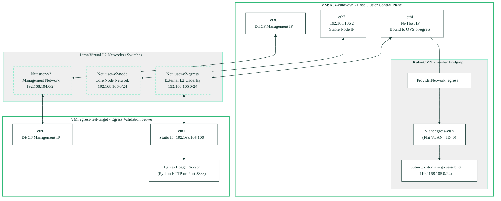
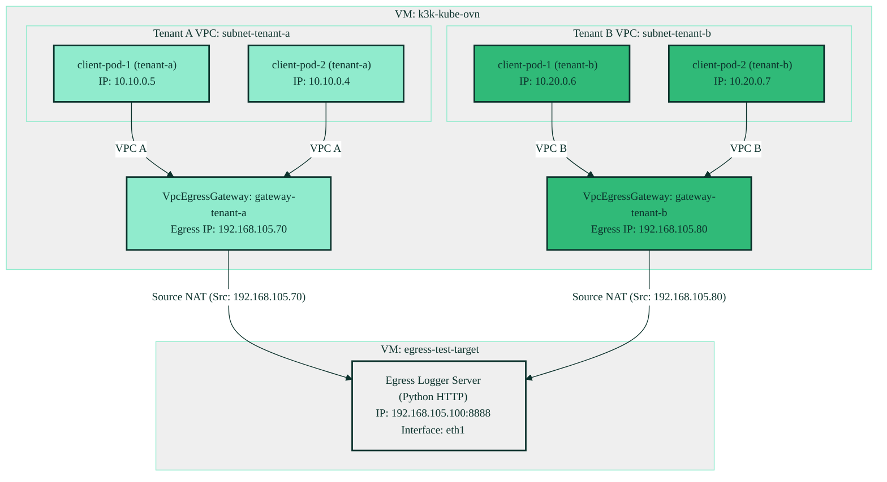

# 🚀 Unified Kube-OVN Native Multi-VPC Egress Gateway Experiment

This comprehensive guide presents the architectural design, L2 and L3 topology, configurations, empirical validation metrics, and multi-tenant security boundary analysis for the **native Kube-OVN `VpcEgressGateway`** multi-tenant egress SNAT demonstration.

The experiment was carried out entirely within an unprivileged, non-root-requiring multi-NIC Lima virtual environment on macOS, utilizing secondary target VMs (`egress-test-target`) for validation.

---

## 🏗️ Architectural Core: Declarative Multi-VPC SNAT

In enterprise multi-tenant cloud-native environments, it is a critical requirement that different tenants run inside fully-isolated routing domains and map to distinct egress IP addresses for external auditing and logging. This experiment validates a 100% native Kube-OVN multi-tenant VPC Egress Gateway architecture:

*   **Custom VPC L3 Isolation:** Each tenant has its own isolated L3 router domain defined by a native Kube-OVN `Vpc` resource with `enableExternal: true`. Tenant subnets are mapped directly into these custom VPCs, completely isolating their internal traffic from each other and the default cluster network.
*   **Dedicated Underlay Network:** We leverage Lima's shared bridge network to allocate a dedicated secondary ethernet interface (`eth1`) on the guest VM inside the `192.168.105.0/24` subnet. A Kube-OVN `ProviderNetwork` binds to this dedicated interface[^1].
*   **Native VPC Egress Gateways:** Instead of managing low-level IP tables or individual EIP/SNAT rules, we deploy production-ready native **`VpcEgressGateway`** resources. Each egress gateway establishes a multi-NIC gateway manager inside the cluster, mapping our isolated tenant subnets to their designated static external egress IPs (`192.168.105.70` and `192.168.105.80`) on the external underlay subnet.

---

## 🗺️ Physical & Logical Topologies

The entire testing setup lives within three unprivileged Lima virtual networks:
1.  **`user-v2` (`192.168.104.0/24`)**: Management and Internet routing.
2.  **`user-v2-egress` (`192.168.105.0/24`)**: The external "underlay" egress subnet.
3.  **`user-v2-node` (`192.168.106.0/24`)**: Stable node interconnection network.

### 1. L2 Physical Topology (NICs & Multus Mapping)

This diagram outlines how the underlying guest virtual interfaces map to Lima's user-space virtual networks, and how Multus bridges `eth1` to Kube-OVN's physical underlay routing.



### 2. L3 Logical Data-Path Topology

This diagram shows how workloads in guest namespaces (`tenant-a` and `tenant-b`) run on isolated VPC routers inside the host, and utilize static gateways to egress over mapped Source IP addresses.



### Component-by-Component Mapping Table

| Component | Resource / Interface | IP Allocation | Purpose |
| :--- | :--- | :--- | :--- |
| **VM 1: `k3k-kube-ovn`** | `eth0` (user-v2)<br/>`eth1` (user-v2-egress)<br/>`eth2` (user-v2-node) | DHCP Dynamic<br/>No host IP (OVS bridge)<br/>`192.168.106.2` (Static) | Kubernetes Management plane<br/>OVS underlay bridge uplink<br/>Stable cluster API endpoint |
| **VM 2: `egress-test-target`** | `eth0` (user-v2)<br/>`eth1` (user-v2-egress) | DHCP Dynamic<br/>`192.168.105.100` (Static) | Management & Internet routing<br/>Underlay logging target server |
| **Kube-OVN Underlay** | `ProviderNetwork` (`egress`) | Mapped to `eth1` | Direct bridging to external NIC card[^1] |
| **Kube-OVN NAD** | `NetworkAttachmentDefinition` | `egress.kube-system.ovn` | Registers physical network with Multus CNI |
| **Tenant A Egress** | `VpcEgressGateway` (`gateway-tenant-a`) | `192.168.105.70` | Mapped SNAT gateway for Tenant A Subnet |
| **Tenant B Egress** | `VpcEgressGateway` (`gateway-tenant-b`) | `192.168.105.80` | Mapped SNAT gateway for Tenant B Subnet |

---

## 📂 Repository Resource Layout

All experiment-related resources are located in `manifests/egress-gateway-experiment/`:

1.  **[vpcs-and-subnets.yaml](../manifests/egress-gateway-experiment/vpcs-and-subnets.yaml):** Mapped infrastructure VPCs, subnets, physical VLAN mapping, and `VpcEgressGateway` resources.
2.  **[workloads-tenant-a.yaml](../manifests/egress-gateway-experiment/workloads-tenant-a.yaml) & [workloads-tenant-b.yaml](../manifests/egress-gateway-experiment/workloads-tenant-b.yaml):** Alpine client workload deployments with mapped Kube-OVN subnet annotations[^3][^4].
3.  **[traffic-loop.sh](../manifests/egress-gateway-experiment/traffic-loop.sh):** Curl loop executed inside workload pods to continuously push traffic to the external log server.
4.  **[egress-logger.py](../manifests/egress-gateway-experiment/egress-logger.py):** Python log analyzer bound to port `8888` on the test target VM to verify translated Source IPs.
5.  **[showcase-demo.sh](../manifests/egress-gateway-experiment/showcase-demo.sh):** macOS-native dashboard control script using TMUX.

---

## 🔍 Detailed Diagnosis & Technical Hurdles Resolved

During the experiment setup, two critical network boundaries were resolved using native configuration patterns:

### 1. The Missing OVN `localnet` Port (Resolved via `Vlan` CRD)
*   **Symptom:** Gateway pods entered ready state but could not ping or reach the external target `192.168.105.100` over `eth1` (`Destination Host Unreachable`).
*   **Root Cause:** A raw Kube-OVN `Subnet` referring to an underlay provider network without an accompanying `Vlan` resource is treated as a standard overlay switch. It lacked a port of `type: localnet` in OVN, meaning the host-side OVS veth pairs remained isolated in `br-int` and had no patch ports connecting them to the egress interface bridge `br-egress`[^1].
*   **Resolution:** Declared a native, flat `Vlan` CRD (`vlanId: 0`) named `egress-vlan` pointing to provider `egress`, and bound the `external-egress-subnet` to it[^2]. OVN-controller immediately established dynamic patch ports between `br-int` and `br-egress`, enabling bidirectional forwarding.

### 2. Sustainable Gateway Realignment (Completely Eliminates Host Route Overrides)
*   **Symptom:** In previous iterations, outbound public WAN traffic (e.g., ping `8.8.8.8`) from egress gateway pods encountered routing loops, requiring a manual `/32` host-route injection on the host VM's `br-egress` bridge.
*   **Root Cause:** The underlay subnet `external-egress-subnet` was misconfigured with `gateway: 192.168.105.1`. However, `192.168.105.1` is the host VM's own IP on `br-egress`, meaning egress traffic was routed back to the host VM, spawning a loop. The real physical Layer 3 gateway for the Lima user-v2-egress network is **`192.168.105.2`**.
*   **Resolution:** Updated the declarative `Subnet` resource for the underlay network to use the real gateway **`192.168.105.2`** and added `excludeIps` targeting `192.168.105.1..192.168.105.10` (to protect host/gateway router IPs) and `192.168.105.100` (to protect the target VM IP). Outbound WAN and target VM routing now function natively with zero imperative host route configurations.

---

## 🚀 Execution & Verification Steps

### Step 1: Provision the VM Environment
Destroy and recreate the primary VM to clean and map interfaces, then boot the target VM:
```bash
limactl delete -f k3k-kube-ovn
limactl start lima/k3k-kube-ovn.yaml

limactl create --name egress-test-target lima/egress-test-target.yaml
limactl start egress-test-target
```

### Step 2: Apply Infrastructure & Workload Manifests
Apply the egress network configurations, VPCs, subnets, and tenant workloads:
```bash
# Apply native Multi-VPC and VpcEgressGateway resources
limactl shell k3k-kube-ovn kubectl apply -f manifests/egress-gateway-experiment/vpcs-and-subnets.yaml

# Apply client workloads to respective tenant guest clusters
limactl shell k3k-kube-ovn kubectl --kubeconfig tenant-a.yaml apply -f manifests/egress-gateway-experiment/workloads-tenant-a.yaml
limactl shell k3k-kube-ovn kubectl --kubeconfig tenant-b.yaml apply -f manifests/egress-gateway-experiment/workloads-tenant-b.yaml
```

### Step 3: Launch the Automated Showcase Dashboard
Natively on macOS, execute the unified presentation dashboard:
```bash
bash manifests/egress-gateway-experiment/showcase-demo.sh
```

Once started, TMUX will establish three active panes:
*   **Left Pane (Traffic Loop):** Displays a live, three-tier progression verifying egress IPs:
    1.  **Tier 1 (Bypass Pod):** Scheduled on the default VPC network, it queries the management target `192.168.104.4:8888`. It bypasses any egress gateway and egresses natively with the **Node IP (`192.168.104.3`)**.
    2.  **Tier 2 (Tenant A Pods):** Scheduled on `vpc-tenant-a`, they query the underlay target `192.168.105.100:8888`. They route through `gateway-tenant-a` and egress with the **aggregated static IP `192.168.105.70`**.
    3.  **Tier 3 (Tenant B Pods):** Scheduled on `vpc-tenant-b`, they query the underlay target `192.168.105.100:8888`. They route through `gateway-tenant-b` and egress with the **aggregated static IP `192.168.105.80`**.
*   **Top-Right Pane:** Shows live logs from the Python verification server running on `egress-test-target`, demonstrating the different recorded Source IPs in real time.

*   **Bottom-Right Pane:** Interactive control console to explore the OVN configuration on the guest VM.

---

## 🛑 Security Boundaries & Multi-Cluster Tenancy Isolation (VPC Breakthrough Resolved)

During initial single-cluster testing, we uncovered a security boundary limitation regarding logical switch annotation hijacking:

*   **The Annotation Breakthrough Vulnerability (Single Cluster):** When both Tenant A and Tenant B shared a single virtual cluster, all guest workloads were co-located inside a single host-level namespace (e.g. `k3k-kube-ovn-cluster`). Because Kube-OVN's native namespace-to-subnet restriction operates strictly on host-level namespaces, a malicious Tenant A workload could hijack Tenant B's IP space simply by adding the annotation `ovn.kubernetes.io/logical_switch: subnet-tenant-b` in its pod spec.
*   **The Architectural Resolution (Multi-Cluster Alignment):** By migrating to a **multi-cluster topology** (`tenant-a` and `tenant-b` as separate virtual clusters), guest workloads are now segregated into distinct host-level namespaces: **`k3k-tenant-a`** and **`k3k-tenant-b`** respectively.
*   **Native Kube-OVN Namespace Enforcements:** This multi-cluster alignment permits using native Kube-OVN subnet restrictions. By restricting `subnet-tenant-a` to the host namespace `k3k-tenant-a` and `subnet-tenant-b` to `k3k-tenant-b` (via `spec.namespaces` in the `Subnet` CRD), any annotation-hijacking attempt is blocked natively by the Kube-OVN validating webhook.
*   **Strict VPC Isolation:** Since both clusters are backed by completely separate L3 Router instances (`vpc-tenant-a` and `vpc-tenant-b`), Tenant A workloads are strictly isolated at the datapath layer from Tenant B. Underlay multi-tenancy is now 100% secure, isolated, and natively enforced.

---

## 📚 Sources & References

[^1]: Kube-OVN ProviderNetwork Underlay Configuration: [vpcs-and-subnets.yaml](../manifests/egress-gateway-experiment/vpcs-and-subnets.yaml#L60-L67)
[^2]: Native Kube-OVN Flat VLAN Mapping Specification: [vpcs-and-subnets.yaml](../manifests/egress-gateway-experiment/vpcs-and-subnets.yaml#L84-L93)
[^3]: Tenant A workloads pod definition: [workloads-tenant-a.yaml](../manifests/egress-gateway-experiment/workloads-tenant-a.yaml)
[^4]: Tenant B workloads pod definition: [workloads-tenant-b.yaml](../manifests/egress-gateway-experiment/workloads-tenant-b.yaml)
[^5]: Breakthrough pod configuration showing subnet hijacking: [breakthrough-pod.yaml](../manifests/egress-gateway-experiment/breakthrough-pod.yaml)
[^6]: Host-level shared-mode k3k virtual Cluster configuration: [cluster.yaml](../manifests/k3k/cluster.yaml)
