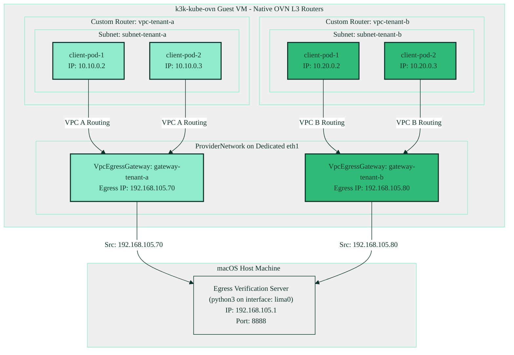

# 🚀 Kube-OVN Native Multi-VPC Egress Gateway Experiment (v2)

This guide provides a comprehensive architectural overview and step-by-step instructions to demonstrate **Source IP translation (SNAT) and Egress IP Aggregation** using **100% Kube-OVN Native** custom resources inside fully isolated **custom tenant VPCs** over a **dedicated physical bridge network**.

---

## 🏗️ Architectural Core: Declarative Multi-VPC SNAT

In enterprise multi-tenant cloud-native environments, it is a critical requirement that different tenants run inside fully-isolated routing domains and map to distinct egress IP addresses for external auditing and logging ([Kube-OVN VPC Network documentation](https://kubeovn.github.io/docs/v1.16.x/en/vpc/vpc-egress-gateway/#vpc-egress-gateway)):

* **Custom VPC L3 Isolation:** Each tenant has its own isolated L3 router domain defined by a native Kube-OVN `Vpc` resource with `enableExternal: true` ([vpcs-and-subnets.yaml:L4-L18](file:///Users/florian.coulombel/src/coulof/k3k-kube-ovn/manifests/egress-gateway-experiment/vpcs-and-subnets.yaml#L4-L18)). Tenant subnets are mapped directly into these custom VPCs, completely isolating their internal traffic from each other and the default cluster network ([vpcs-and-subnets.yaml:L20-L54](file:///Users/florian.coulombel/src/coulof/k3k-kube-ovn/manifests/egress-gateway-experiment/vpcs-and-subnets.yaml#L20-L54)).
* **Dedicated Underlay Network:** We leverage Lima's shared bridge network to allocate a dedicated secondary ethernet interface (`eth1`) on the guest VM inside the `192.168.105.0/24` subnet ([lima/k3k-kube-ovn.yaml:L24-L27](file:///Users/florian.coulombel/src/coulof/k3k-kube-ovn/lima/k3k-kube-ovn.yaml#L24-L27)). A Kube-OVN `ProviderNetwork` binds to this dedicated interface ([vpcs-and-subnets.yaml:L56-L63](file:///Users/florian.coulombel/src/coulof/k3k-kube-ovn/manifests/egress-gateway-experiment/vpcs-and-subnets.yaml#L56-L63)).
* **Native VPC Egress Gateways:** Instead of managing low-level IP tables or individual EIP/SNAT rules, we deploy production-ready native **`VpcEgressGateway`** resources ([vpcs-and-subnets.yaml:L76-L105](file:///Users/florian.coulombel/src/coulof/k3k-kube-ovn/manifests/egress-gateway-experiment/vpcs-and-subnets.yaml#L76-L105)). Each egress gateway establishes a multi-NIC gateway manager inside the cluster, mapping our isolated tenant subnets to their designated static external egress IPs (`192.168.105.70` and `192.168.105.80`) on the external underlay subnet.

---

## 🗺️ Architectural Topology



---

## 📂 Configuration Layout

All configuration manifests are located under `manifests/egress-gateway-experiment/`:

1. **[vpcs-and-subnets.yaml](file:///Users/florian.coulombel/src/coulof/k3k-kube-ovn/manifests/egress-gateway-experiment/vpcs-and-subnets.yaml):** Declares Kube-OVN custom resources including custom VPCs, subnets, ProviderNetwork on `eth1`, external underlay Subnet, and the native `VpcEgressGateway` configurations.
2. **[workloads-tenant-a.yaml](file:///Users/florian.coulombel/src/coulof/k3k-kube-ovn/manifests/egress-gateway-experiment/workloads-tenant-a.yaml) & [workloads-tenant-b.yaml](file:///Users/florian.coulombel/src/coulof/k3k-kube-ovn/manifests/egress-gateway-experiment/workloads-tenant-b.yaml):** Isolated multi-pod alpine testing workloads running inside the virtual guest clusters, correctly mapped via logical switch annotations.
3. **[traffic-loop.sh](file:///Users/florian.coulombel/src/coulof/k3k-kube-ovn/manifests/egress-gateway-experiment/traffic-loop.sh):** Continuous curl flow executions from client pods targeting the macOS host bridge IP.
4. **[egress-logger.py](file:///Users/florian.coulombel/src/coulof/k3k-kube-ovn/manifests/egress-gateway-experiment/egress-logger.py):** Python-based lightweight web server running natively on macOS on port `8888` to inspect and color-log incoming requests.
5. **[showcase-demo.sh](file:///Users/florian.coulombel/src/coulof/k3k-kube-ovn/manifests/egress-gateway-experiment/showcase-demo.sh):** macOS-native dashboard control script using TMUX.

---

## 🚀 Execution & Verification Steps

### Step 1: Recreate/Provision the VM
Because the `user-v2-egress` and `user-v2-node` interfaces must be configured on virtual machine creation, destroy and recreate the Lima VM:
```bash
limactl delete -f k3k-kube-ovn
limactl start lima/k3k-kube-ovn.yaml
```

### Step 2: Apply the Declarative Manifests
Apply the infrastructure manifests and tenant workloads directly to the fresh cluster:
```bash
# Apply native Multi-VPC and VpcEgressGateway resources
limactl shell k3k-kube-ovn kubectl apply -f manifests/egress-gateway-experiment/vpcs-and-subnets.yaml

# Apply client workloads to respective tenant guest clusters
limactl shell k3k-kube-ovn kubectl --kubeconfig tenant-a.yaml apply -f manifests/egress-gateway-experiment/workloads-tenant-a.yaml
limactl shell k3k-kube-ovn kubectl --kubeconfig tenant-b.yaml apply -f manifests/egress-gateway-experiment/workloads-tenant-b.yaml
```

### Step 3: Launch the Automated Showcase Dashboard
Natively on macOS, execute the unified presentation dashboard:
```bash
bash manifests/egress-gateway-experiment/showcase-demo.sh
```

### Step 4: Observe the Live TMUX Dashboard
Once started, TMUX will establish three active panes:
* **Left Pane:** Displays continuous curl executions from multiple pods inside isolated Tenant A and Tenant B virtual clusters.
* **Top-Right Pane:** Shows live logs from the **macOS native** Python verification server, demonstrating that requests from both `client-pod-1` and `client-pod-2` inside Tenant A map back to the **single aggregated egress IP `192.168.105.70`**, and Tenant B to **`192.168.105.80`**.
* **Bottom-Right Pane:** Interactive control console to dynamically explore the OVN configuration on the guest VM.
