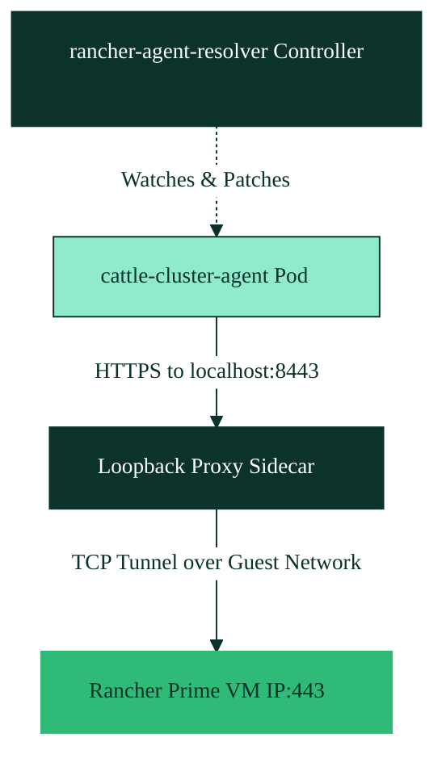

# Troubleshooting & Fix: Localhost DNS Routing for Rancher Agents

This guide documents the root cause and the permanent standalone fix for resolving `.localhost` routing limitations inside Kubernetes pod network namespaces (such as `cattle-cluster-agent` trying to reach Rancher Prime at `lima-rancher-prime.localhost`).

---

## 🔍 The Problem

To provide zero-configuration local browser access from macOS without requiring administrative/`sudo` privileges, we use a domain ending in `.localhost` (e.g., `lima-rancher-prime.localhost`) [.agents/AGENTS.md:L16-L23](../.agents/AGENTS.md#L16-L23). macOS natively and automatically resolves any `.localhost` domain to `127.0.0.1`.

However, inside Kubernetes pods (like the `cattle-cluster-agent` in the `cattle-system` namespace), this setup fails with `Connection Refused` or connection timeouts.

### Why does this happen?
1. **Go Resolver & RFC 6761 compliance:**
   The Rancher agent is a compiled Go binary. Statically compiled Go binaries (using the pure Go resolver package) strictly enforce **RFC 6761**. When resolving any domain ending with `.localhost`, the Go resolver bypasses the socket layer, ignores CoreDNS, and bypasses the guest's `/etc/hosts` file completely. It immediately and hardcodes the resolution to `127.0.0.1`.
2. **Isolated Pod Network Namespaces:**
   When the agent resolves the Rancher address to `127.0.0.1`, it attempts to connect to port `443` inside its own isolated pod network namespace. Because nothing is listening on port `443` inside that container's loopback interface, the connection fails.

---

## 🏗️ The Fix: Port 8443 Sidecar Proxy & Controller

To resolve this "for good" in a completely standalone and automated way, we deploy a lightweight **Rancher Agent Resolver Controller** inside the `kube-system` namespace.



### 1. The Loopback-Proxy Sidecar
A standard sidecar proxy listening on `127.0.0.1:443` cannot be used because the embedded Rancher agent itself binds to port `443` of the pod on startup. This causes a port bind conflict: `failed to ListenAndServe: listen tcp :443: bind: address already in use`.

To prevent this collision, we use a **dual-port redirection strategy**:
* **`CATTLE_SERVER` URL Redirection:** The agent's destination URL is patched to use port `8443` (`https://lima-rancher-prime.localhost:8443`) [manifests/rancher/rancher-agent-resolver.yaml:L92](../manifests/rancher/rancher-agent-resolver.yaml#L92).
* **Non-Conflicting Proxy:** A lightweight `alpine/socat` sidecar is injected into the pod. It listens on `127.0.0.1:8443` and transparently forwards all traffic to the Rancher Prime VM's dynamic IP address on port `443` [manifests/rancher/rancher-agent-resolver.yaml:L92](../manifests/rancher/rancher-agent-resolver.yaml#L92).

### 2. The Auto-Patching Controller
Because the downstream agent deployment and credentials secrets are managed dynamically by Rancher and can be overwritten on upgrades or re-registration, we deploy a lightweight self-healing controller manifest [manifests/rancher/rancher-agent-resolver.yaml](../manifests/rancher/rancher-agent-resolver.yaml).

The controller script:
1. **Resolves the Rancher Prime VM's IP address** on the shared `user-v2` network using Lima's standard `<VM_NAME>.internal` DNS name [manifests/rancher/rancher-agent-resolver.yaml:L57-L63](../manifests/rancher/rancher-agent-resolver.yaml#L57-L63).
2. **Scans all namespaces** for any deployment named `cattle-cluster-agent` [manifests/rancher/rancher-agent-resolver.yaml:L74-L80](../manifests/rancher/rancher-agent-resolver.yaml#L74-L80).
3. **Patches the `cattle-credentials` secret**: Since the compiled Go-based Rancher agent binary bypasses the standard socket environment variables and parses the server URL directly from its mounted credentials secret (`/cattle-credentials/url`), the controller locates and updates the secret's base64 registration URL to use port `8443` (`https://lima-rancher-prime.localhost:8443`) [manifests/rancher/rancher-agent-resolver.yaml:L82-L91](../manifests/rancher/rancher-agent-resolver.yaml#L82-L91).
4. **Patches the Deployment**: It injects the `alpine/socat` sidecar listening on loopback port `8443` (tunneling to Rancher Prime's VM IP on `443`) and updates the `CATTLE_SERVER` environment variable [manifests/rancher/rancher-agent-resolver.yaml:L93-L98](../manifests/rancher/rancher-agent-resolver.yaml#L93-L98).

---

## 🚀 How to Reintroduce or Apply the Fix

When upgrading the system, creating a new VM, or setting up a new multi-VM template, follow these steps to reintroduce the fix:

### Step 1: Ensure the Manifest is in Your Workspace
Make sure you have the [manifests/rancher/rancher-agent-resolver.yaml](../manifests/rancher/rancher-agent-resolver.yaml) file present in your local project directory.

### Step 2: Configure Automatic Copy on Boot (VM Provisioning)
To ensure that RKE2 automatically installs the resolver on startup, configure your Lima template (`lima/*.yaml`) to mount the workspace directory and copy the manifest to RKE2's auto-deploy manifests folder:

Add the following to the `provision` script section in your Lima template [lima/k3k-kube-ovn.yaml:L195-L200](../lima/k3k-kube-ovn.yaml#L195-L200):

```yaml
      # Copy the rancher-agent-resolver manifest
      if [ -f "${MANIFESTS_DIR}/rancher/rancher-agent-resolver.yaml" ]; then
        echo "Copying rancher-agent-resolver manifest from mount..."
        cp "${MANIFESTS_DIR}/rancher/rancher-agent-resolver.yaml" /var/lib/rancher/rke2/server/manifests/rancher-agent-resolver.yaml
      fi
```

*Note: RKE2's built-in deploy controller monitors `/var/lib/rancher/rke2/server/manifests/` and will automatically apply and reconcile any manifest placed there on boot or file update.*

### Step 3: Manual Re-application (Fallback)
If you need to manually apply the resolver manifest to an active cluster, run this command from your Mac terminal:

```bash
# Apply the resolver manifest directly to the cluster
limactl shell k3k-kube-ovn sudo /var/lib/rancher/rke2/bin/kubectl --kubeconfig /etc/rancher/rke2/rke2.yaml apply -f /Users/florian.coulombel/src/coulof/k3k-kube-ovn/manifests/rancher/rancher-agent-resolver.yaml
```

---

## 🔬 How to Verify

After VM deployment or manual application, verify that everything is running correctly:

1. **Check the Resolver Pod:**
   Ensure the resolver pod is in a `Running` state:
   ```bash
   limactl shell k3k-kube-ovn kubectl get pods -n kube-system -l app=rancher-agent-resolver
   ```
2. **Check the Rancher Agent Pod:**
   Ensure the `cattle-cluster-agent` has been patched and is running with `2/2` containers ready:
   ```bash
   limactl shell k3k-kube-ovn kubectl get pods -n cattle-system
   ```
3. **Verify the Agent Logs:**
   Verify that the agent connects successfully to Rancher Prime over the loopback-proxy:
   ```bash
   limactl shell k3k-kube-ovn kubectl logs -n cattle-system deployment/cattle-cluster-agent -c cluster-register | tail -n 10
   ```
