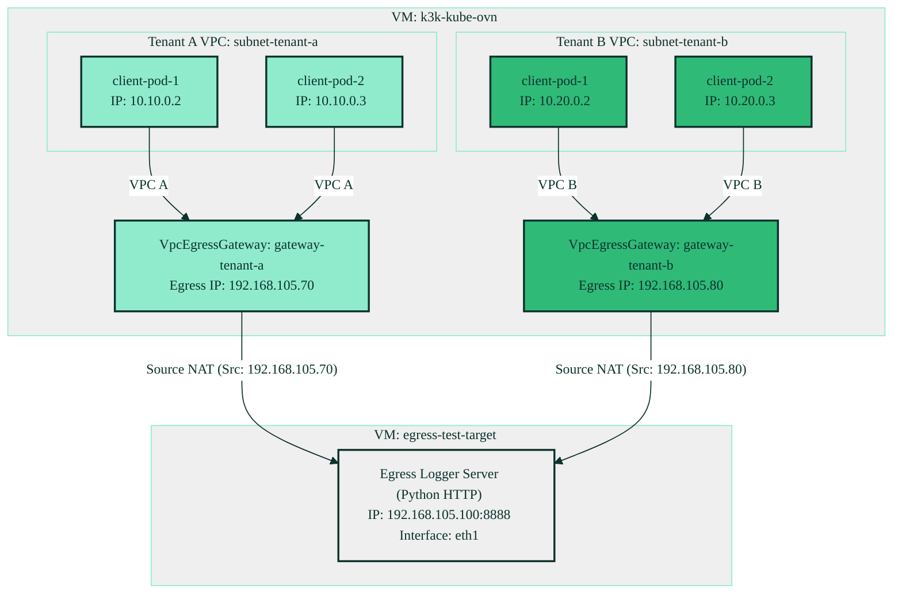

# Simplified Native Kube-OVN VPC Egress Gateway Verification Plan

This plan implements a 100% native Kube-OVN multi-tenant VPC Egress Gateway architecture and validates it **entirely within the unprivileged guest network space**.

By introducing a lightweight secondary VM (`egress-test-target`), we avoid all macOS-level socket/port-forwarding, DNS, or packet routing complexities. Both VMs connect directly via the unprivileged, user-space `user-v2-egress` network.

---

## 🏗️ Architectural Layout and IP Allocations

The entire testing setup lives within three unprivileged Lima virtual networks:
1. **`user-v2` (`192.168.104.0/24`)**: Management and Internet routing.
2. **`user-v2-egress` (`192.168.105.0/24`)**: The external "underlay" egress subnet.
3. **`user-v2-node` (`192.168.106.0/24`)**: Stable node interconnection network.



### Component-by-Component Mapping

| Component | Resource / Interface | IP Allocation | Purpose |
|---|---|---|---|
| **VM 1: `k3k-kube-ovn`** | `eth0` (user-v2)<br/>`eth1` (user-v2-egress)<br/>`eth2` (user-v2-node) | Dynamic<br/>No host IP (OVS bridge)<br/>`192.168.106.2` | Kubernetes Control Plane & CNI<br/>Mapped to Kube-OVN ProviderNetwork<br/>Stable control plane address |
| **VM 2: `egress-test-target`** | `eth0` (user-v2)<br/>`eth1` (user-v2-egress) | Dynamic<br/>`192.168.105.100` (Static) | Management & Internet routing<br/>Underlay testing target running HTTP logger |
| **Kube-OVN Underlay** | `ProviderNetwork` (`egress`) | Matches `eth1` | Mapped directly to guest network card |
| **Kube-OVN NAD** | `NetworkAttachmentDefinition` | `egress.kube-system.ovn` | Links the underlay Subnet to Multus CNI |
| **Tenant A Egress** | `VpcEgressGateway` (`gateway-tenant-a`) | `192.168.105.70` | Performs SNAT for `subnet-tenant-a` (`10.10.0.0/16`) |
| **Tenant B Egress** | `VpcEgressGateway` (`gateway-tenant-b`) | `192.168.105.80` | Performs SNAT for `subnet-tenant-b` (`10.20.0.0/16`) |

---

## Proposed Changes

### 1. [NEW] [egress-test-target.yaml](file:///Users/florian.coulombel/src/coulof/k3k-kube-ovn/lima/egress-test-target.yaml)
Defines a lightweight (1 CPU, 1GiB RAM) testing target VM. It automatically:
* Configures static IP `192.168.105.100` on `eth1`.
* Boots a lightweight Python log listener on port `8888` under a systemd service (`egress-logger.service`).

### 2. [MODIFY] [vpcs-and-subnets.yaml](file:///Users/florian.coulombel/src/coulof/k3k-kube-ovn/manifests/egress-gateway-experiment/vpcs-and-subnets.yaml)
Simplifies the schema to integrate Multus and Kube-OVN ProviderNetwork correctly:
* Declares `NetworkAttachmentDefinition` named `egress` in `kube-system`.
* Configures `external-egress-subnet` with `provider: egress.kube-system.ovn` to associate with Multus cleanly.

### 3. [MODIFY] [traffic-loop.sh](file:///Users/florian.coulombel/src/coulof/k3k-kube-ovn/manifests/egress-gateway-experiment/traffic-loop.sh)
Points the client pod testing URL to the VM target: `http://192.168.105.100:8888`.

### 4. [MODIFY] [showcase-demo.sh](file:///Users/florian.coulombel/src/coulof/k3k-kube-ovn/manifests/egress-gateway-experiment/showcase-demo.sh)
Launches a simplified TMUX session:
* **Pane 0 (Left):** Runs the workloads' traffic loop inside the guest cluster.
* **Pane 1 (Right):** Tails the live log stream of the `egress-test-target` VM.

---

## Verification Plan

### Automated/Manual Verification Sequence

1. **Rebuild Guest VM:**
   ```bash
   limactl create --name k3k-kube-ovn lima/k3k-kube-ovn.yaml
   limactl start k3k-kube-ovn
   ```

2. **Deploy Test Target VM:**
   ```bash
   limactl create --name egress-test-target lima/egress-test-target.yaml
   limactl start egress-test-target
   ```

3. **Deploy Egress Infrastructure:**
   ```bash
   limactl shell k3k-kube-ovn kubectl apply -f manifests/egress-gateway-experiment/vpcs-and-subnets.yaml
   ```

4. **Verify Gateway Pod Readiness:**
   ```bash
   limactl shell k3k-kube-ovn kubectl get vpc-egress-gateways
   ```

5. **Deploy Tenant Workloads & Verify Egress SNAT:**
   ```bash
   limactl shell k3k-kube-ovn kubectl --kubeconfig tenant-a.yaml apply -f manifests/egress-gateway-experiment/workloads-tenant-a.yaml
   limactl shell k3k-kube-ovn kubectl --kubeconfig tenant-b.yaml apply -f manifests/egress-gateway-experiment/workloads-tenant-b.yaml
   ```

6. **Showcase Verification:**
   Run `bash manifests/egress-gateway-experiment/showcase-demo.sh` on macOS. It will connect to the test-target logs and show the source IP mapping cleanly.
