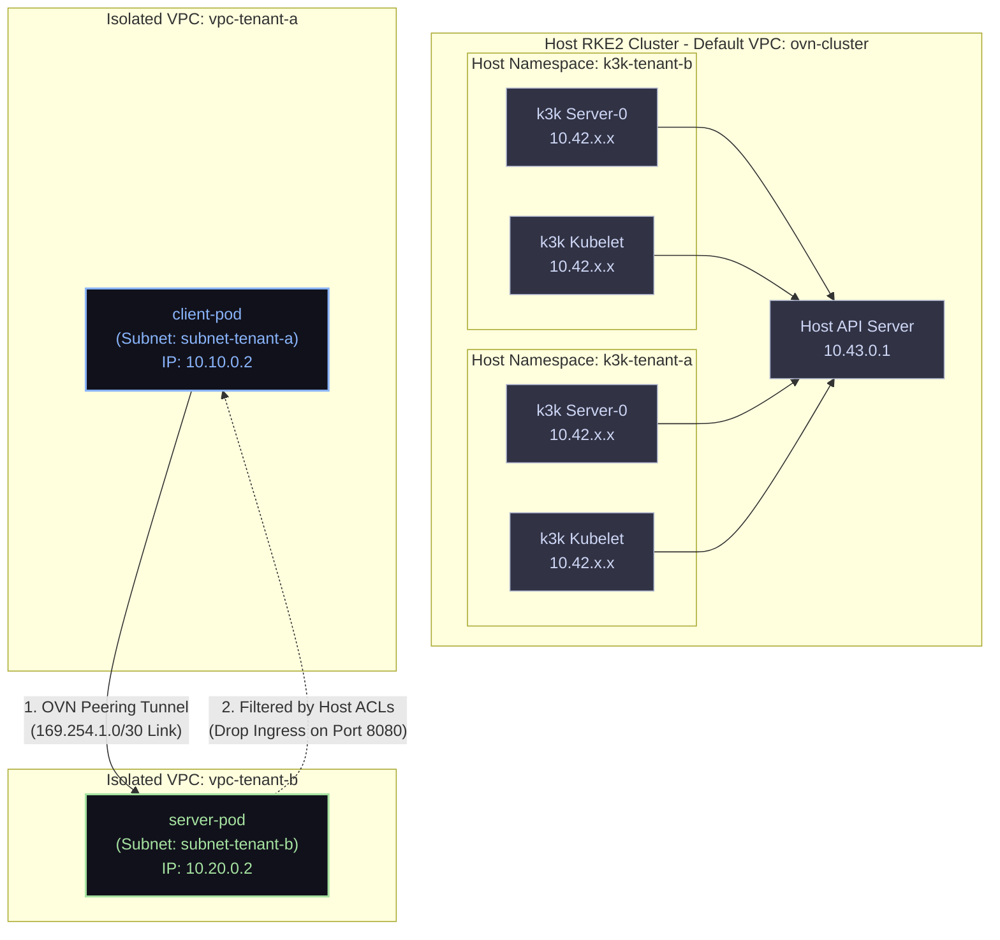
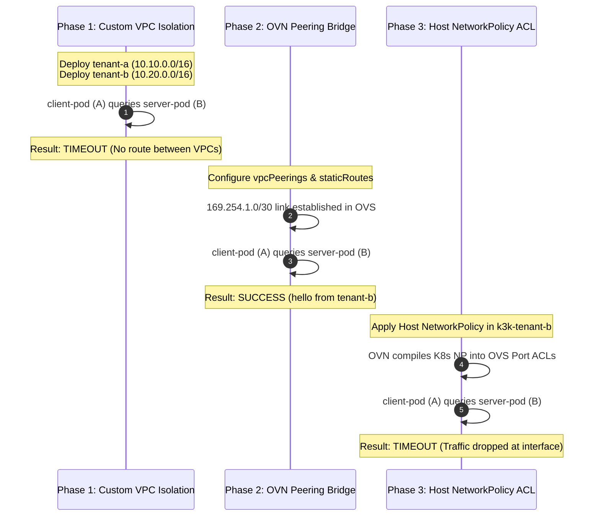

# 🌉 Kube-OVN VPC Peering & Host NetworkPolicy Demo

This guide provides a comprehensive, step-by-step manual and architectural blueprint to demonstrate and reproduce **custom VPC isolation, high-performance VPC Peering, and host-level NetworkPolicy enforcement** using **k3k** virtual clusters in shared mode on RKE2.

---

## 🏗️ Architectural Core: Metadata Delegation Pattern

In `k3k` shared mode, virtual control plane components and guest workloads run as host pods under the host namespace `k3k-<cluster_name>`. 

To leverage Kube-OVN's custom `Vpc` routing without breaking the virtual control planes (which need direct access to the host's Kubernetes API server `10.43.0.1:443`), we utilize the **Metadata Delegation Pattern**:
* **Control Planes in Default VPC:** The host namespaces `k3k-tenant-a` and `k3k-tenant-b` are left unbound to any custom VPC. Thus, the virtual servers (`tenant-a-server-0`, etc.) and virtual kubelets are assigned IPs from the default host subnet (`ovn-default` in default VPC `ovn-cluster`), ensuring perfect DNS and Kubernetes API routing.
* **Workloads in Custom VPCs:** We create custom VPCs (`vpc-tenant-a` and `vpc-tenant-b`) and subnets. Guest workload pods are annotated inside the guest specs with `ovn.kubernetes.io/logical_switch: <subnet>`. The `k3k` virtual kubelet replicates this annotation on the host. Kube-OVN automatically places these workloads in the custom VPCs!

---

## 🗺️ Architectural Diagrams

### 1. Network Topology & Traffic Flows
The diagram below illustrates the multi-VPC isolation, the OVN-level peering tunnel, and the host-enforced NetworkPolicy filtering:



### 2. Multi-Phase Experimental Sequence
The lifecycle of the experiment progresses through three distinct phases:



---

## 📂 Complete Manifest Configurations

All manifests are organized under `manifests/vpc-peering-experiment/`:

### 1. VPCs and Subnets Manifest
* **File Path:** `manifests/vpc-peering-experiment/vpcs-and-subnets.yaml`
* **Purpose:** Provisions the isolated custom VPC logical routers and their respective workload subnets.

```yaml
apiVersion: kubeovn.io/v1
kind: Vpc
metadata:
  name: vpc-tenant-a
spec: {}
---
apiVersion: kubeovn.io/v1
kind: Subnet
metadata:
  name: subnet-tenant-a
spec:
  cidrBlock: 10.10.0.0/16
  default: false
  enableLb: true
  excludeIps:
  - 10.10.0.1
  gateway: 10.10.0.1
  gatewayType: distributed
  natOutgoing: true
  private: false
  protocol: IPv4
  provider: ovn
  vpc: vpc-tenant-a
---
apiVersion: kubeovn.io/v1
kind: Vpc
metadata:
  name: vpc-tenant-b
spec: {}
---
apiVersion: kubeovn.io/v1
kind: Subnet
metadata:
  name: subnet-tenant-b
spec:
  cidrBlock: 10.20.0.0/16
  default: false
  enableLb: true
  excludeIps:
  - 10.20.0.1
  gateway: 10.20.0.1
  gatewayType: distributed
  natOutgoing: true
  private: false
  protocol: IPv4
  provider: ovn
  vpc: vpc-tenant-b
```

---

### 2. k3k Clusters Manifest
* **File Path:** `manifests/vpc-peering-experiment/k3k-clusters.yaml`
* **Purpose:** Creates isolated namespaces and registers the dual virtual clusters with CIDRs matching the custom subnets.

```yaml
apiVersion: v1
kind: Namespace
metadata:
  name: k3k-tenant-a
---
apiVersion: k3k.io/v1beta1
kind: Cluster
metadata:
  name: tenant-a
  namespace: k3k-tenant-a
spec:
  mode: shared
  servers: 1
  agents: 0
  clusterCIDR: "10.10.0.0/16"
  serviceCIDR: "10.110.0.0/16"
  clusterDNS: "10.110.0.10"
  persistence:
    type: none
  serverArgs:
    - "--flannel-backend=none"
    - "--disable-network-policy"
---
apiVersion: v1
kind: Namespace
metadata:
  name: k3k-tenant-b
---
apiVersion: k3k.io/v1beta1
kind: Cluster
metadata:
  name: tenant-b
  namespace: k3k-tenant-b
spec:
  mode: shared
  servers: 1
  agents: 0
  clusterCIDR: "10.20.0.0/16"
  serviceCIDR: "10.120.0.0/16"
  clusterDNS: "10.120.0.10"
  persistence:
    type: none
  serverArgs:
    - "--flannel-backend=none"
    - "--disable-network-policy"
```

---

### 3. Tenant-A Workload (Client)
* **File Path:** `manifests/vpc-peering-experiment/workloads-a.yaml`
* **Purpose:** Deploys a client testing container mapped to the `subnet-tenant-a` via annotations.

```yaml
apiVersion: v1
kind: Pod
metadata:
  name: client-pod
  namespace: default
  annotations:
    ovn.kubernetes.io/logical_switch: subnet-tenant-a
spec:
  containers:
  - name: client
    image: alpine
    command: ["sh", "-c", "sleep 36000"]
```

---

### 4. Tenant-B Workload (Server)
* **File Path:** `manifests/vpc-peering-experiment/workloads-b.yaml`
* **Purpose:** Deploys a listening `netcat` HTTP service mapped to `subnet-tenant-b`, annotated with custom metadata labels.

```yaml
apiVersion: v1
kind: Pod
metadata:
  name: server-pod
  namespace: default
  labels:
    app: server-app
  annotations:
    ovn.kubernetes.io/logical_switch: subnet-tenant-b
spec:
  containers:
  - name: server
    image: alpine
    command: ["sh", "-c", "while true; do echo -e 'HTTP/1.1 200 OK\n\nhello from tenant-b' | nc -l -p 8080; done"]
    ports:
    - containerPort: 8080
      name: http
```

---

### 5. VPC Peering Configuration
* **File Path:** `manifests/vpc-peering-experiment/peering.yaml`
* **Purpose:** Establishes the bi-directional OVN peering interconnect and configures explicit static routing.

```yaml
apiVersion: kubeovn.io/v1
kind: Vpc
metadata:
  name: vpc-tenant-a
spec:
  vpcPeerings:
    - remoteVpc: vpc-tenant-b
      localConnectIP: 169.254.1.1/30
  staticRoutes:
    - cidr: 10.20.0.0/16
      nextHopIP: 169.254.1.2
      policy: policyDst
---
apiVersion: kubeovn.io/v1
kind: Vpc
metadata:
  name: vpc-tenant-b
spec:
  vpcPeerings:
    - remoteVpc: vpc-tenant-a
      localConnectIP: 169.254.1.2/30
  staticRoutes:
    - cidr: 10.10.0.0/16
      nextHopIP: 169.254.1.1
      policy: policyDst
```

---

### 6. Host NetworkPolicy Configuration
* **File Path:** `manifests/vpc-peering-experiment/networkpolicy.yaml`
* **Purpose:** Restricts port 8080 traffic to allow only local `tenant-b` source pods, denying the peered `tenant-a` subnet.

```yaml
apiVersion: networking.k8s.io/v1
kind: NetworkPolicy
metadata:
  name: secure-peered-server
  namespace: k3k-tenant-b
spec:
  podSelector:
    matchLabels:
      app: server-app
  policyTypes:
  - Ingress
  ingress:
  # Allow ingress traffic only from within tenant-b's own workload CIDR.
  # This automatically blocks the peered traffic from tenant-a (10.10.0.0/16).
  - from:
    - ipBlock:
        cidr: 10.20.0.0/16
    ports:
    - protocol: TCP
      port: 8080
```

---

## 🛠️ Step-by-Step Reproduction Guide

Execute all commands within your **`k3k-kube-ovn`** Lima VM session or using `limactl shell k3k-kube-ovn`.

### Step 1: Deploy Infrastructure Baseline
Create the infrastructure resources on the host:
```bash
# 1. Apply VPCs and Subnets
kubectl apply -f manifests/vpc-peering-experiment/vpcs-and-subnets.yaml

# 2. Apply k3k Clusters
kubectl apply -f manifests/vpc-peering-experiment/k3k-clusters.yaml
```

Wait until both virtual clusters register as `Ready` (this may take up to 2 minutes due to the server's initial readiness delay):
```bash
kubectl get clusters.k3k.io -A
```

---

### Step 2: Extract Guest Credentials
Extract the guest cluster kubeconfigs from host secrets to interact with them:
```bash
# Extract tenant-a kubeconfig
kubectl get secret k3k-tenant-a-kubeconfig -n k3k-tenant-a -o jsonpath='{.data.kubeconfig\.yaml}' | base64 -d > tenant-a.yaml

# Extract tenant-b kubeconfig
kubectl get secret k3k-tenant-b-kubeconfig -n k3k-tenant-b -o jsonpath='{.data.kubeconfig\.yaml}' | base64 -d > tenant-b.yaml
```

---

### Step 3: Deploy Tenant Workloads
Deploy client and server pods using the newly generated virtual credentials:
```bash
# Deploy client pod in tenant-a
kubectl --kubeconfig tenant-a.yaml apply -f manifests/vpc-peering-experiment/workloads-a.yaml

# Deploy server pod in tenant-b
kubectl --kubeconfig tenant-b.yaml apply -f manifests/vpc-peering-experiment/workloads-b.yaml
```

Verify both workload pods have achieved the `Running` state and obtained IPs from their respective custom subnets:
```bash
# Verify tenant-a client pod
kubectl --kubeconfig tenant-a.yaml get pods -o wide

# Verify tenant-b server pod
kubectl --kubeconfig tenant-b.yaml get pods -o wide
```
* **Expected IPs:** `client-pod` should have IP `10.10.0.2`; `server-pod` should have IP `10.20.0.2`.

---

### Step 4: Verify Phase 1 Isolation (Baseline)
Execute a connectivity test from the client to the server:
```bash
kubectl --kubeconfig tenant-a.yaml exec client-pod -- wget -T 5 -O- http://10.20.0.2:8080
```
* **Output:**
  ```
  Connecting to 10.20.0.2:8080 (10.20.0.2:8080)
  wget: download timed out
  command terminated with exit code 1
  ```
* **Verification:** VPC Isolation is working. Traffic cannot bridge across the separate VPC routers.

---

### Step 5: Establish VPC Peering (Phase 2)
Apply the peering configuration to interconnect the two VPC routers:
```bash
kubectl apply -f manifests/vpc-peering-experiment/peering.yaml
```

Verify that Kube-OVN has established the peerings in status:
```bash
kubectl get vpc vpc-tenant-a -o jsonpath='{.status.vpcPeerings}'
```
* **Expected Output:** `["vpc-tenant-b"]`

Now, test connectivity again:
```bash
kubectl --kubeconfig tenant-a.yaml exec client-pod -- wget -T 5 -O- http://10.20.0.2:8080
```
* **Output:**
  ```
  Connecting to 10.20.0.2:8080 (10.20.0.2:8080)
  hello from tenant-b
  ```
* **Verification:** VPC Peering is fully active. Traffic routes seamlessly over the OVN logical peer bridge.

---

### Step 6: Secure Peered Link with NetworkPolicy (Phase 3)
Apply the Kubernetes NetworkPolicy on the host cluster to filter the peered traffic:
```bash
kubectl apply -f manifests/vpc-peering-experiment/networkpolicy.yaml
```

Test connectivity from the tenant-a client one final time:
```bash
kubectl --kubeconfig tenant-a.yaml exec client-pod -- wget -T 5 -O- http://10.20.0.2:8080
```
* **Output:**
  ```
  Connecting to 10.20.0.2:8080 (10.20.0.2:8080)
  wget: download timed out
  command terminated with exit code 1
  ```
* **Verification:** The NetworkPolicy successfully dropped the peered ingress traffic, leaving internal `tenant-b` pod communications secure.

---

## 📺 Interactive TMUX Showcase Dashboard

To make it incredibly easy to present, observe, and interact with this multi-phase demo, we have created an automated **TMUX Showcase Dashboard**. It splits your terminal into a 2x2 grid, establishing real-time observers and an interactive control panel:

* **Top-Left (Pane 0):** A continuous, colorized traffic testing loop showing connectivity status from `client-pod` to `server-pod`.
* **Bottom-Left (Pane 1):** Real-time monitoring of Kube-OVN VPC peering links and subnet definitions.
* **Top-Right (Pane 2):** Real-time monitoring of host-level `NetworkPolicies` and matching server pod labels.
* **Bottom-Right (Pane 3):** An interactive **Control Console** where you can run simple helper commands (`peer`, `unpeer`, `secure`, `unsecure`, `status`, `menu`) to toggle each phase of the demo and see the results instantly propagate to the other panes!

### Launching the Dashboard

Simply run the following command from your macOS terminal to launch the dashboard inside the guest VM:

```bash
limactl shell k3k-kube-ovn bash manifests/vpc-peering-experiment/showcase-demo.sh
```

### Steering the Demo Interactively

In the bottom-right terminal pane (active by default), use these simple commands to guide your audience or test the setup:

1. **Phase 1 Baseline (Isolated):** If peerings are already active, run `unpeer`. The Top-Left traffic loop will instantly switch to a red **`[🔴 BLOCKED]`** status as OVS isolation takes effect.
2. **Phase 2 Peering (Connected):** Run `peer`. The Top-Left traffic loop will instantly switch to a green **`[🟢 SUCCESS]`** status showing `"hello from tenant-b"`.
3. **Phase 3 Secure (NetworkPolicy Enforced):** Run `secure`. The Top-Left traffic loop will instantly switch to a red **`[🔴 BLOCKED]`** status as host-level ACLs drop the peering traffic, while the Top-Right pane shows the newly applied `secure-peered-server` policy!
4. **Restore Peering:** Run `unsecure`. The traffic loop will immediately recover to green **`[🟢 SUCCESS]`**.

To exit the showcase, simply press `Ctrl+C` in any running loops/watches and type `exit` or detach from TMUX using `Ctrl+B` then `D`.

---

## 🧹 Complete Cleanup Commands

Run the following commands to safely tear down the experimental resources from the host:

```bash
# 1. Delete guest workloads
kubectl --kubeconfig tenant-a.yaml delete pod client-pod --wait=false 2>/dev/null || true
kubectl --kubeconfig tenant-b.yaml delete pod server-pod --wait=false 2>/dev/null || true

# 2. Delete NetworkPolicy
kubectl delete -f manifests/vpc-peering-experiment/networkpolicy.yaml --wait=false 2>/dev/null || true

# 3. Delete k3k virtual clusters and namespaces
kubectl delete -f manifests/vpc-peering-experiment/k3k-clusters.yaml 2>/dev/null || true

# 4. Delete custom subnets and VPCs
kubectl delete -f manifests/vpc-peering-experiment/vpcs-and-subnets.yaml 2>/dev/null || true

# 5. Remove local kubeconfigs
rm -f tenant-a.yaml tenant-b.yaml
```
